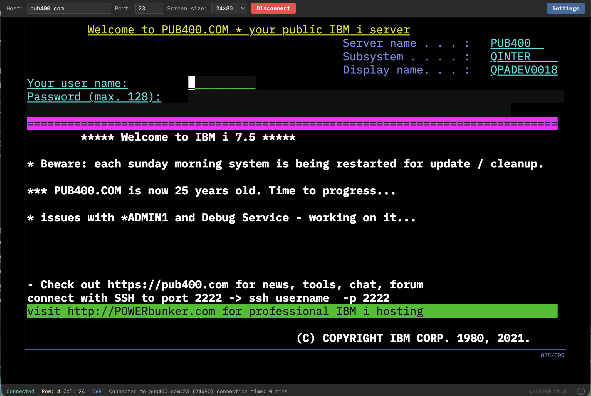

# A browser-based IBM 5250 terminal to connect to OS/400 systems

## Instructions
obtain the binary you need and then launch it from your shell like this:
      
./web5250 -listen :9000 -host pub400.com -port 23
  
Now connect your browser to localhost:9000, or whatever IP you have this running on.

That's it. 

## TLS (HTTPS)

The web UI can be served over TLS. Point `-tls-cert` / `-tls-key` at your
certificate and key files:

HTTPS only (TLS on the `-listen` port):

    ./web5250 -listen :443 -tls-cert cert.pem -tls-key key.pem

HTTP and HTTPS at the same time, each on its own port:

    ./web5250 -listen :9000 -tls-listen :9443 -tls-cert cert.pem -tls-key key.pem

HTTPS only on a dedicated port (disable the plain listener):

    ./web5250 -listen "" -tls-listen :9443 -tls-cert cert.pem -tls-key key.pem

To encrypt the connection to the AS/400 itself, use `-host-tls` (typically with
`-port 992`).

copyright 2026 by moshix, all rights reserved

## Screenshot

